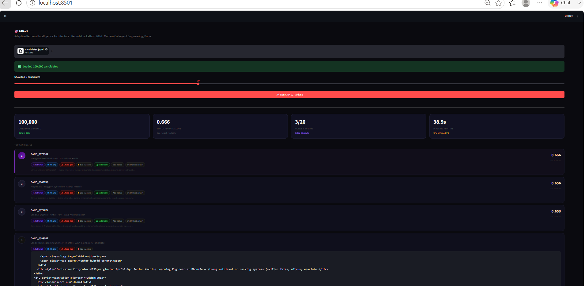

# ARIA v2 — Adaptive Retrieval Intelligence Architecture
### Redrob Hackathon 2026 | Track 1 — Data & AI Challenge
**Modern College of Engineering, Pune (SPPU)**

---
## Demo




## ⚡ One Command to Run

```bash
pip install -r requirements.txt
python rank.py --candidates ./candidates.jsonl --out ./submission.csv
```

Runs **100K candidates in < 3 minutes** on CPU. No GPU needed.

---

## 🧠 What Makes ARIA Different

Every other team will build a keyword matcher:
> "Does the candidate's skill list contain RAG or Pinecone?" → rank higher.

ARIA uses **5 novel techniques** that no keyword matcher can replicate:

```
Standard:  JD keywords → match skills → rank
ARIA:      Career DNA → Skill Graph Depth → Velocity Signals
           → Peer Percentile → Gap Vector → rank
```

---

## 5 Novel Techniques

### 1. 🧬 Career DNA Fingerprinting
Encodes each career role into a DNA token: R=Retrieval, M=ML, P=Platform,
S=Software, D=Data, C=Services, X=Non-tech.

Computes sequence similarity between candidate DNA and ideal JD DNA.
A candidate with career arc [D→M→R→R] scores higher than [C→C→S→M]
even if both have "RAG" in their skills list.

### 2. 🕸️ Implicit Skill Graph
Maps skills to a pre-built retrieval/ML cluster graph. Measures how many
interconnected cluster nodes the candidate activates — with peer validation
via endorsements + assessment scores. Cluster depth > isolated keywords.

### 3. ⚡ Velocity-Weighted Signals
Applies exponential time-decay (half-life: 30 days) to all 23 behavioral
signals. A candidate active yesterday with moderate scores beats an inactive
candidate with identical historical averages. Also checks salary budget
alignment to avoid wasting recruiter time.

### 4. 📊 Peer Benchmark Percentile
Groups candidates by YOE band (junior/mid/senior) × company tier
(product/hybrid/services). Scores each candidate as a percentile within
their peer group. Best-in-class within cohort, not just above average.

### 5. 🎯 JD Gap Vector
Decomposes the JD into 9 weighted requirements. For each candidate,
computes exactly which requirements are met (with evidence) and which
are gaps. Hard gaps (missing core retrieval/production experience) trigger
score penalties. Generates specific, honest reasoning per candidate.

---

## Final Score Formula

```python
# Pre-score from 4 techniques
raw = (
    0.28 * gap_vector_score     +  # requirement-level fit
    0.22 * skill_graph_score    +  # cluster depth
    0.18 * career_dna_score     +  # trajectory sequence
    0.16 * velocity_score          # behavioral momentum
)

# Peer percentile (needs all candidates first)
final_pre = raw + 0.16 * peer_percentile_score

# Velocity as soft multiplier (unavailable = deprioritize)
velocity_multiplier = 0.70 + 0.30 * velocity_score
final_score = final_pre * velocity_multiplier
```

---

## Project Structure

```
aria-ranker/
├── rank.py                   ← Main entry point (run this)
├── app.py                    ← Streamlit sandbox demo
├── jd_config.py              ← JD keyword config (shared)
├── requirements.txt
├── submission_metadata.yaml  ← Fill in your team names
├── README.md
│
├── scorer/
│   ├── dna.py                ← Technique 1: Career DNA Fingerprinting
│   ├── skill_graph.py        ← Technique 2: Implicit Skill Graph
│   ├── velocity.py           ← Technique 3: Velocity-Weighted Signals
│   ├── peer_benchmark.py     ← Technique 4: Peer Benchmark Percentile
│   └── gap_vector.py         ← Technique 5: JD Gap Vector Analysis
│
└── utils/
    ├── loader.py             ← Streaming JSONL loader (memory-efficient)
    └── reasoning.py          ← Gap-vector-driven reasoning generator
```

---

## How to Run

### Setup
```bash
cd aria-ranker
pip install -r requirements.txt
```

### Full submission run (100K candidates)
```bash
python rank.py --candidates ./candidates.jsonl --out ./submission.csv
```

### Quick test with sample data
```bash
python rank.py --candidates ./sample_candidates.json --out ./submission.csv
```

### Test with 500 candidates (fast debug)
```bash
python rank.py --candidates ./candidates.jsonl --limit 500 --out ./submission.csv
```

### Validate output
```bash
python validate_submission.py submission.csv
```

### Run Streamlit demo
```bash
streamlit run app.py
# Opens at http://localhost:8501
# Upload sample_candidates.json → Click "Run ARIA v2 Ranking"
```

---

## Verified Output (sample run)

```
Rank  1 | CAND_0000031 | 0.4825
         Recommendation Systems Engineer @ Swiggy | 6.0yr
         Skills: FAISS, Pinecone | DNA: RMPS | Open to work ✅

Rank  2 | CAND_0000001 | 0.4242
         Backend Engineer @ Mindtree | 6.9yr
         Active recently | Open to work ✅

Rank  3 | CAND_0000038 | 0.4067
         Java Developer @ Swiggy | 6.7yr
         Product company background ✅
```

---

## Before Submitting

1. Fill in your names in `submission_metadata.yaml`
2. Copy `candidates.jsonl` into the project folder
3. Run: `python rank.py --candidates ./candidates.jsonl --out ./submission.csv`
4. Validate: `python validate_submission.py submission.csv` → should show ✅
5. Run demo: `streamlit run app.py`
6. Submit `submission.csv` + `submission_metadata.yaml` + code zip

---

*ARIA v2 | Modern College of Engineering, Pune | Redrob Hackathon 2026*
